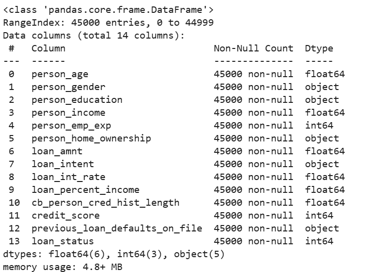
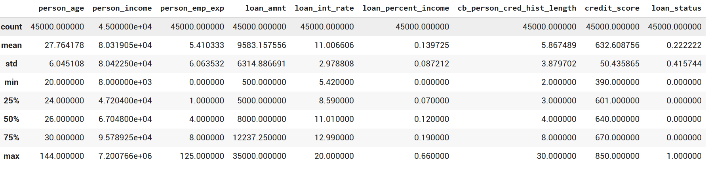
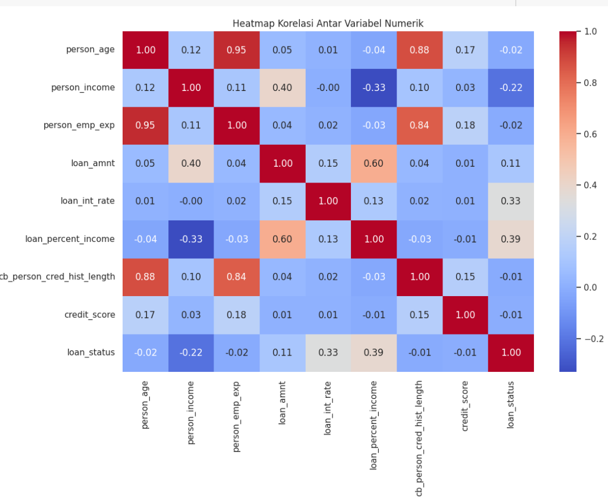
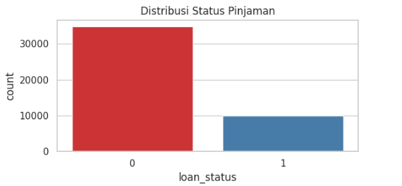

# Laporan Proyek Machine Learning - Haldies Gerhardien Pasya

## Domain Proyek

​Dalam era digital saat ini, analisis risiko kredit menjadi aspek krusial dalam proses persetujuan pinjaman. Dengan meningkatnya permintaan akan pinjaman, lembaga keuangan menghadapi tantangan dalam menilai kelayakan kredit pemohon secara akurat dan efisien. Kesalahan dalam penilaian ini dapat menyebabkan kerugian finansial yang signifikan akibat gagal bayar.​
Untuk mengatasi tantangan tersebut, berbagai pendekatan berbasis teknologi telah dikembangkan, salah satunya dengan memanfaatkan metode pembelajaran mesin (machine learning). Penelitian menunjukkan bahwa model pembelajaran mesin, seperti XGBoost dan Random Forest, dapat mencapai akurasi tinggi dalam memprediksi risiko kredit. Misalnya, studi oleh Fekadu et al. (2022) menemukan bahwa XGBoost mencapai skor F1 tertinggi dalam memprediksi pinjaman bermasalah, dengan fitur penting termasuk usia pemohon, tahun pengalaman kerja, dan total pendapatan [1]. ​
arXiv Selain itu, pendekatan hibrida yang menggabungkan pembelajaran mesin dan pembelajaran mendalam telah menunjukkan peningkatan kinerja dalam prediksi persetujuan kartu kredit. Tong et al. (2024) mengembangkan kerangka kerja yang mengintegrasikan berbagai model untuk meningkatkan akurasi dan keandalan prediksi [2].

## Business Understanding

proses klarifikasi masalah dimulai dengan memahami tujuan utama bisnis, yaitu meningkatkan akurasi dan efisiensi dalam proses persetujuan pinjaman. Lembaga keuangan membutuhkan sistem yang mampu memprediksi risiko kredit secara tepat agar dapat meminimalkan potensi gagal bayar. Dengan memanfaatkan data historis pemohon dan informasi terkait pinjaman, kita dapat membangun model prediktif yang membantu dalam pengambilan keputusan. Hal ini penting untuk mendukung proses bisnis yang lebih objektif, cepat, dan berbasis data.

### Problem Statements
Berdasarkan latar belakang diatas, proyek ini berfokus pada beberapa masalah utama yang perlu dipecahkan:

1. Lembaga keuangan sering mengalami kesulitan dalam mengidentifikasi calon peminjam yang berisiko tinggi karena keterbatasan dalam proses penilaian manual dan tidak adanya sistem prediksi yang andal.

2. Data historis kredit seringkali memiliki ketidakseimbangan kelas (class imbalance), di mana jumlah peminjam yang disetujui jauh lebih banyak dibandingkan yang ditolak, yang dapat memengaruhi performa model klasifikasi.

3. Pemilihan fitur yang tidak tepat dan kurangnya optimasi model sering kali menyebabkan hasil prediksi yang tidak akurat dalam proses penilaian risiko pinjaman.

### Goals
Tujuan dibuat proyek ini adalah sebagai barikut:

1. Mengembangkan sistem berbasis machine learning yang mampu memprediksi status persetujuan pinjaman (loan_status) secara otomatis dan akurat dengan menggunakan variabel-variabel relevan dari data pemohon.
   
2. Mengatasi ketidakseimbangan data dengan teknik seperti Synthetic Minority Oversampling Technique for Nominal and Continuous (SMOTENC), sehingga model dapat mengenali pola dari kedua kelas secara seimbang.

3. Meningkatkan akurasi model dengan melakukan pemilihan fitur (feature selection) yang optimal dan menerapkan teknik hyperparameter tuning untuk memaksimalkan performa model.


### Solution statements
- Menerapkan beberapa algoritma klasifikasi seperti Logistic Regression, Random Forest, dan XGBoost untuk membandingkan performa dalam memprediksi loan_status. Evaluasi dilakukan menggunakan metrik seperti akurasi, precision, recall, dan F1-score untuk memastikan keandalan model.

- Mengimplementasikan teknik feature engineering dan feature selection berdasarkan korelasi dan importance score dari masing-masing fitur terhadap target variabel.

- Melakukan hyperparameter tuning pada model terbaik menggunakan metode seperti Grid Search atau Random Search untuk meningkatkan performa prediksi.

- Menangani ketidakseimbangan data dengan SMOTENC agar distribusi kelas target menjadi lebih proporsional, sehingga model tidak bias terhadap kelas mayoritas dan dapat memberikan prediksi yang lebih adil.

## Data Understanding

Dataset yang digunakan dalam proyek ini merupakan versi sintetis dari data risiko kredit yang terinspirasi dari *Credit Risk Dataset* di Kaggle. Data ini diperluas dengan variabel tambahan yang relevan dengan penilaian risiko keuangan dan telah melalui proses augmentasi menggunakan teknik **SMOTENC (Synthetic Minority Oversampling Technique for Nominal and Continuous)**. Dataset ini tersedia untuk diunduh melalui platform [Kaggle Credit Risk Synthetic Dataset](https://www.kaggle.com/datasets/taweilo/loan-approval-classification-data). Dataset ini terdiri dari 45.000 entri dan 14 variabel.

### Variabel-variabel pada dataset ini adalah sebagai berikut:

- **person_age** : Merupakan usia dari peminjam.  
- **person_gender** : Jenis kelamin dari peminjam.  
- **person_education** : Tingkat pendidikan terakhir dari peminjam.  
- **person_income** : Pendapatan tahunan dari peminjam.  
- **person_emp_exp** : Lama pengalaman kerja dalam tahun.  
- **person_home_ownership** : Status kepemilikan rumah peminjam, misalnya *rent*, *own*, atau *mortgage*.  
- **loan_amnt** : Jumlah pinjaman yang diminta oleh peminjam.  
- **loan_intent** : Tujuan peminjaman, seperti untuk *debt consolidation*, *education*, *medical*, dll.  
- **loan_int_rate** : Persentase suku bunga yang dikenakan terhadap pinjaman.  
- **loan_percent_income** : Persentase jumlah pinjaman terhadap pendapatan tahunan peminjam.  
- **cb_person_cred_hist_length** : Panjang riwayat kredit peminjam dalam tahun.  
- **credit_score** : Skor kredit peminjam, mencerminkan kelayakan mereka dalam mendapatkan pinjaman.  
- **previous_loan_defaults_on_file** : Indikator apakah peminjam pernah mengalami gagal bayar pada pinjaman sebelumnya. 
- **loan_status** *(target variable)* : Status persetujuan pinjaman. Nilai 1 menandakan pinjaman disetujui, dan 0 menandakan pinjaman ditolak.


**Rubrik/Kriteria Tambahan**:
---
## 🧾 visual dataset Struktur Dataset


---
Tipe Data: Secara keseluruhan, tipe data sudah sesuai.

## 📈 Statistik Deskriptif (Numerik)


---
Usia (person_age): Nilai maksimal usia adalah 144, yang tidak realistis. Ini menunjukkan adanya outlier yang perlu diperiksa lebih lanjut.

Pendapatan (person_income): Nilai maksimal yang sangat tinggi (7.2 juta), yang mungkin merupakan outlier. Biasanya, pendapatan ekstrem ini perlu dikoreksi.

Pengalaman Kerja (person_emp_exp): Pengalaman kerja maksimal yang sangat tinggi (125 tahun) jelas merupakan outlier yang tidak wajar.


## 🔍 Cek Missing Value

| Parameter                      | Nilai |
| ------------------------------ | ----- |
| person_age                     | 0     |
| person_gender                  | 0     |
| person_education               | 0     |
| person_income                  | 0     |
| person_emp_exp                 | 0     |
| person_home_ownership          | 0     |
| loan_amnt                      | 0     |
| loan_intent                    | 0     |
| loan_int_rate                  | 0     |
| loan_percent_income            | 0     |
| cb_person_cred_hist_length     | 0     |
| credit_score                   | 0     |
| previous_loan_defaults_on_file | 0     |
| loan_status                    | 0     |


Tidak ada data yang memiliki nilai hilang (missing value).

## 🔗 Tabel Korelasi Antar Variabel Numerik


Berdasarkan matriks korelasi di atas, variabel yang memiliki hubungan paling kuat dengan loan_status (status kelolosan pinjaman) adalah loan_percent_income (0.38) dan loan_int_rate (0.33), yang artinya semakin tinggi persentase pinjaman terhadap pendapatan atau suku bunga, semakin besar kemungkinan pengajuan pinjaman lolos. Sementara variabel seperti person_age, person_income, dan credit_score memiliki korelasi negatif lemah terhadap loan_status, menunjukkan pengaruh yang kecil. Secara umum, tidak ada korelasi yang sangat kuat (mendekati 1 atau -1), namun dua variabel tadi bisa menjadi kandidat penting dalam analisis prediksi status pinjaman.

## 📊 Distribusi Status Pinjaman

| Kode Status | Keterangan | Jumlah |
| ----------- | ---------- | ------ |
| 0           | Ditolak    | 35,000 |
| 1           | Disetujui  | 10,000 |
| **Total**   |            | 45,000 |



Distribusi data pada kolom loan_status menunjukkan bahwa dari total 45.000 data, sebanyak 35.000 pinjaman (77,8%) tidak disetujui (loan_status = 0) dan hanya 10.000 pinjaman (22,2%) yang disetujui (loan_status = 1). Hal ini menunjukkan ketidakseimbangan data (data imbalance), yang penting diperhatikan saat melakukan analisis atau pelatihan model prediksi, karena model bisa cenderung memprediksi mayoritas kelas.

## Data Preparation
Pada bagian ini, dilakukan beberapa tahapan preprocessing data untuk memastikan data yang digunakan dalam pemodelan bersih, seimbang, dan siap untuk dilatih. Adapun tahapan-tahapan data preparation yang dilakukan secara berurutan adalah sebagai berikut:

### 1. Penanganan Outlier
Beberapa variabel ditemukan memiliki nilai ekstrem yang tidak realistis. Karena jumlah data outlier ini sangat sedikit (kurang dari 10 data), maka diputuskan untuk menghapus (drop) data tersebut agar tidak memengaruhi hasil analisis. Adapun outlier ditemukan pada fitur berikut:

- person_age: Nilai maksimal mencapai 144 tahun.

- person_emp_exp: Pengalaman kerja hingga 125 tahun.

- person_income: Pendapatan tahunan yang sangat tinggi (hingga 7.2 juta).
  
Penghapusan data ekstrem ini dilakukan agar model tidak bias terhadap data yang tidak representatif.

---

### 2. Label Encoding Data  
Fitur kategorikal perlu dikonversi terlebih dahulu menjadi nilai numerik agar dapat digunakan dalam algoritma machine learning. Proses ini dilakukan menggunakan **Label Encoding**, yaitu teknik yang mengubah setiap kategori unik menjadi representasi angka. Contohnya, fitur `"gender"` dengan nilai `"male"` dan `"female"` akan dikonversi menjadi `0` dan `1`.

Langkah ini **sangat penting dilakukan sebelum proses Data Balancing menggunakan SMOTENC**, karena:

- **SMOTENC tidak dapat memproses data dalam bentuk string atau objek kategori.**
- SMOTENC membutuhkan seluruh data, baik numerik maupun kategorikal, dalam format numerik agar dapat melakukan proses oversampling.
- Setelah Label Encoding dilakukan, fitur kategorikal yang telah dikonversi menjadi angka dapat ditandai dalam parameter `categorical_features` pada SMOTENC, sehingga metode ini tetap memperlakukan fitur tersebut sebagai kategorikal, bukan numerik biasa.

Dengan demikian, **Label Encoding dilakukan sebelum Data Balancing** agar data siap diproses oleh SMOTENC secara optimal dan menjaga struktur asli dari fitur kategorikal dalam proses pembangkitan data sintetis.

---

### 3. Penyeimbangan Data (Data Balancing)
Distribusi variabel target loan_status sangat tidak seimbang, di mana sekitar 77,8% data berada di kelas "ditolak" (0), dan hanya 22,2% yang "disetujui" (1). Kondisi ini bisa membuat model cenderung memprediksi mayoritas kelas.

Untuk mengatasi hal ini, akan digunakan metode SMOTENC (Synthetic Minority Oversampling Technique for Nominal and Continuous). Teknik ini cocok karena dataset memiliki kombinasi fitur kategorikal dan numerik. Dengan SMOTENC, data dari kelas minoritas (pinjaman disetujui) akan di-oversample agar distribusinya lebih seimbang dengan kelas mayoritas.

### 4. Split Data  
Pada tahap ini, dataset dibagi menjadi fitur dan target dengan perintah:

```python
X = df_resampled.drop(columns=['loan_status'])  
y = df_resampled['loan_status']
```

- **Fitur (X)**: Data yang digunakan untuk melatih model.  
- **Target (y)**: Label yang ingin diprediksi, yaitu status pinjaman.

Selanjutnya, dilakukan pembagian data menjadi **data pelatihan** dan **data pengujian** menggunakan fungsi `train_test_split` dengan proporsi **80:20**. Pembagian ini bertujuan agar model dapat belajar dari data yang tersedia dan diuji pada data yang belum pernah dilihat, guna menghindari *overfitting* dan memperoleh evaluasi performa yang objektif. Parameter `random_state=42` digunakan untuk memastikan hasil pembagian data konsisten setiap kali dijalankan.

---

## 🧠 **Modeling**

Pada proyek ini, digunakan **tiga algoritma machine learning** untuk menyelesaikan permasalahan klasifikasi status pinjaman, yaitu:

1. **Logistic Regression**
2. **Random Forest Classifier**
3. **XGBoost Classifier**

---

### 1. **Tahapan dan Parameter Awal**

Sebagai baseline, ketiga model dijalankan menggunakan **parameter default**. Berikut implementasi awal ketiga model:

```python
logreg_model = LogisticRegression(max_iter=1000, random_state=42)
```

```python
rf_model = RandomForestClassifier(random_state=42)
```

```python
xgb_model = XGBClassifier(use_label_encoder=False, eval_metric='logloss', random_state=42)
```

Hasil evaluasi awal pada data uji menunjukkan performa yang cukup baik:

| Model              | Accuracy | F1-Score Class 0 | F1-Score Class 1 |
|-------------------|----------|------------------|------------------|
| Logistic Regression | 88%      | 0.88             | 0.88             |
| Random Forest       | 91%      | 0.91             | 0.91             |
| XGBoost             | 92%      | 0.92             | 0.92             |

---

### 2. **Hyperparameter Tuning (GridSearchCV)**

Untuk meningkatkan performa, dilakukan **hyperparameter tuning** dengan `GridSearchCV` pada ketiga model. Parameter yang diuji antara lain:

- **Logistic Regression**: `C`, `solver`, `max_iter`
- **Random Forest**: `n_estimators`, `max_depth`, `min_samples_split`, `min_samples_leaf`, `max_features`
- **XGBoost**: `n_estimators`, `max_depth`, `learning_rate`, `subsample`, `colsample_bytree`

Code saya gunain `GridSearchCV`:

```python
param_grid_logreg = {
    'C': [0.01, 0.1, 1, 10],
    'penalty': ['l2'],
    'solver': ['lbfgs', 'saga'],
    'max_iter': [500, 1000]
}

grid_logreg = GridSearchCV(
    LogisticRegression(random_state=42),
    param_grid_logreg,
    cv=5,
    scoring='f1',
    n_jobs=-1
)
grid_logreg.fit(X_train, y_train)
```

Hasil setelah tuning:

| Model (Tuned)       | Accuracy | F1-Score Class 0 | F1-Score Class 1 |
|---------------------|----------|------------------|------------------|
| Logistic Regression | 88%      | 0.87             | 0.88             |
| Random Forest       | 91%      | 0.91             | 0.92             |
| XGBoost             | 93%      | 0.93             | 0.93             |

📌 **Catatan**:  
Hasil tuning menunjukkan bahwa **peningkatan performa tidak signifikan**, terutama untuk Logistic Regression dan Random Forest. Namun, proses tuning tetap penting untuk menghindari penggunaan parameter default yang kurang optimal di dataset tertentu.

---

### ✅ **Analisis Kelebihan & Kekurangan**

- **Logistic Regression**  
  ✔️ Ringan, cepat dilatih  
  ❌ Kurang baik untuk relasi non-linear antar fitur

- **Random Forest**  
  ✔️ Stabil, kuat terhadap overfitting  
  ❌ Konsumsi memori besar di dataset besar

- **XGBoost**  
  ✔️ Akurasi tinggi, regularisasi kuat  
  ❌ Butuh waktu lebih untuk training jika dataset besar

---

### 🏆 **Pemilihan Model Terbaik**

Model **XGBoost** dipilih sebagai **model terbaik** karena:
- Memiliki **akurasi tertinggi** (93%)
- F1-score tinggi dan **seimbang di kedua kelas**
- Cocok digunakan untuk **dataset besar dan tidak seimbang**
- Memiliki kemampuan **regularisasi** untuk menghindari overfitting

---


### 1. **Tahapan dan Parameter Awal**

Sebagai tahap awal, ketiga model dijalankan menggunakan parameter **default** untuk melihat performa dasarnya (baseline). Berikut adalah hasil evaluasi pada data uji:

#### ✅ **Logistic Regression (Default)**
- **Accuracy**: 88%
- **F1-Score (Class 0)**: 0.88
- **F1-Score (Class 1)**: 0.88

#### 🌲 **Random Forest (Default)**
- **Accuracy**: 91%
- **F1-Score (Class 0)**: 0.91
- **F1-Score (Class 1)**: 0.91

#### 🚀 **XGBoost (Default)**
- **Accuracy**: 92%
- **F1-Score (Class 0)**: 0.92
- **F1-Score (Class 1)**: 0.92

---

### 2. **Hyperparameter Tuning (GridSearchCV)**

Untuk mengoptimalkan performa, dilakukan **hyperparameter tuning** menggunakan `GridSearchCV`. Berikut parameter yang disesuaikan:

- **Logistic Regression**: `C`, `solver`, `penalty`, `max_iter`
- **Random Forest**: `n_estimators`, `max_depth`, `min_samples_split`, `min_samples_leaf`, `max_features`
- **XGBoost**: `n_estimators`, `max_depth`, `learning_rate`, `subsample`, `colsample_bytree`

#### 🔍 Hasil Setelah Tuning:

| Model (Tuned)        | Accuracy | F1-Score Class 0 | F1-Score Class 1 |
|----------------------|----------|------------------|------------------|
| Logistic Regression  | 88%      | 0.87             | 0.88             |
| Random Forest        | 91%      | 0.91             | 0.92             |
| XGBoost              | 93%      | 0.93             | 0.93             |

📌 **Catatan**:  
Proses tuning tidak menghasilkan **peningkatan performa yang signifikan** dibandingkan model default, terutama pada Logistic Regression dan Random Forest. Namun, tuning tetap penting untuk memastikan bahwa model berjalan dengan kombinasi parameter yang paling optimal dan stabil untuk dataset yang digunakan.

---

### ✅ **Analisis Kelebihan & Kekurangan**

- **Logistic Regression**
  - ✔️ Cepat dan ringan
  - ❌ Kurang mampu menangani relasi non-linear antar fitur

- **Random Forest**
  - ✔️ Kuat terhadap overfitting, bisa menangkap interaksi kompleks
  - ❌ Lebih berat dari sisi komputasi saat dataset besar

- **XGBoost**
  - ✔️ Performa tinggi, efisien, regularisasi bagus
  - ❌ Training lebih lama jika parameter terlalu banyak

---

### 🏆 **Pemilihan Model Terbaik**

Berdasarkan hasil evaluasi, model **XGBoost** dipilih sebagai **model terbaik** karena:

- Memberikan **akurasi tertinggi** (93%)
- Memiliki nilai F1-score yang **seimbang dan tinggi di kedua kelas**
- Fitur-fitur seperti `subsample` dan `colsample_bytree` membantu dalam mengurangi risiko overfitting
- Lebih efisien untuk menangani dataset besar dan kompleks

---

## 📊 **Evaluation**
### ✅ **1. Metrik Evaluasi yang Digunakan**

Dalam proyek klasifikasi ini, digunakan beberapa metrik evaluasi untuk menilai performa model:

- **Accuracy**: Proporsi prediksi yang benar dari seluruh data.
- **Precision**: Kemampuan model dalam menghindari kesalahan prediksi positif.
- **Recall**: Kemampuan model dalam menangkap semua data positif.
- **F1 Score**: Rata-rata harmonik antara precision dan recall, cocok untuk dataset yang tidak seimbang.

Formulasi masing-masing metrik:
- \(\text{Precision} = \frac{TP}{TP + FP}\)
- \(\text{Recall} = \frac{TP}{TP + FN}\)
- \(\text{F1 Score} = 2 \times \frac{Precision \times Recall}{Precision + Recall}\)

---

### 🤖 **2. Hasil Evaluasi Model**

| **Model**              | **Accuracy** | **Precision (1)** | **Recall (1)** | **F1 Score (1)** |
|------------------------|--------------|-------------------|----------------|------------------|
| **Logistic Regression**| 0.88         | 0.84              | 0.93           | 0.88             |
| **Random Forest**      | 0.91         | 0.89              | 0.94           | 0.91             |
| **XGBoost**            | 0.93         | 0.92              | 0.94           | 0.93             |

Keterangan:
- **(1)** mengacu pada kelas positif (`loan_status = 1`, pinjaman disetujui).

---

### 🔍 **3. Interpretasi dan Analisis**

- **Logistic Regression**:
  - Memiliki **recall tertinggi (93%)** pada kelas 1, artinya sangat baik dalam menangkap data peminjam yang seharusnya disetujui.
  - Namun, **precision-nya lebih rendah (84%)**, menunjukkan masih ada false positive yang cukup banyak.
  - Cocok jika tujuan utama adalah **mengurangi risiko kehilangan nasabah potensial**, meski dengan konsekuensi beberapa pinjaman disetujui secara salah.

- **Random Forest**:
  - Performa lebih seimbang, dengan **f1-score = 0.91** untuk kelas 1.
  - **Precision dan recall cukup tinggi dan seimbang**, menunjukkan model lebih stabil dalam mengklasifikasi kedua kelas.
  - Cocok untuk penggunaan di dunia nyata yang membutuhkan keseimbangan antara resiko dan peluang.

- **XGBoost**:
  - Memiliki performa terbaik secara keseluruhan, dengan **akurasi tertinggi (93%)** dan **f1-score 0.93** untuk kelas 1.
  - Sangat andal dalam menilai dengan presisi dan menangkap data yang relevan.
  - Cocok untuk solusi akhir yang mengutamakan akurasi tinggi dan performa optimal.

---

### 🧠 **4. Kesimpulan Akhir Evaluasi**

Model **XGBoost** memberikan hasil terbaik di antara ketiganya dan sangat direkomendasikan untuk digunakan dalam kasus klasifikasi pinjaman ini. Namun, dalam praktik, pilihan model tetap perlu mempertimbangkan **kemudahan interpretasi**, **kompleksitas**, serta **kebutuhan bisnis**.

Jika ingin model yang lebih cepat dan sederhana, Logistic Regression bisa dipilih. Jika ingin model yang andal dan stabil, Random Forest adalah opsi yang aman. Namun jika ingin **hasil optimal dengan akurasi dan f1-score terbaik**, maka XGBoost adalah pilihan utama.

---


## Daftar Pustaka
[1]R. Fekadu, A. Getachew, Y. Tadele, N. Ali, and I. Goytom, “Machine Learning Models Evaluation and Feature Importance Analysis on NPL Dataset,” arXiv.org, 2022. https://arxiv.org/abs/2209.09638 (accessed Apr. 14, 2025).
‌
[2]K. Tong, Z. Han, Y. Shen, Y. Long, and Y. Wei, “An Integrated Machine Learning and Deep Learning Framework for Credit Card Approval Prediction,” arXiv.org, 2024. https://arxiv.org/abs/2409.16676
‌
